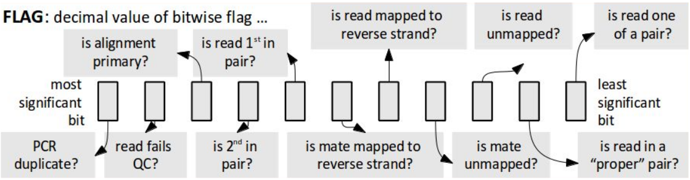
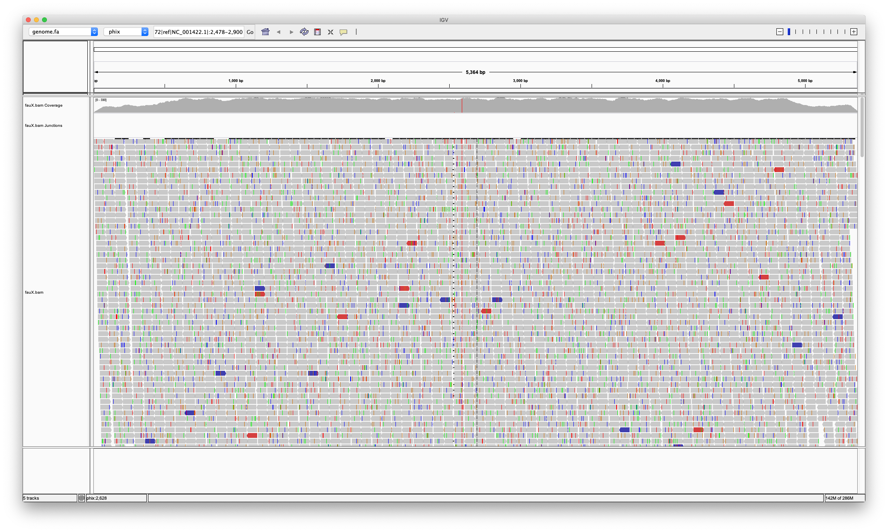

### Reference means what?

#### What do we want to know about an organism's genome?

- Sequence and coordinates on the molecules themselves
    - DNA (chromosomes, plasmids, cDNA?)
    - mRNA
    - protein
- Annotation on the coordinate system
    - genes
    - repeats
    - pseudogenes
    - conserved regions (e.g. alignment to other species)
    - variant regions (normal / diseased sequence variation)
    - regulatory stuff
    - epigenetic marks, chromatin interactions, etc.
    - aligned reads from targeted / shotgun sequencing

#### File formats

- Sequence
    - (nucleotides) ... fasta (*.fasta, *.fa, *.fna)

```
>sequenceName_and|lots of other-junk/with/no\standards #pretty	much
ACGTUacgtuNn-_.*   # line wraps at 80 or any number of characters (\n for Unix/Linux, \r\n or ^M Windows, \r classic MacOS)
MRWSYKVHDBN        # IUPAC Ambiguity Codes
```

    - (amino acids) ... fasta (*.fasta, *.fa, *.faa)

```
>sequenceName
ACDE...WY
```

- Annotation
    - [UCSC Genome Browser File Format FAQ](https://genome.ucsc.edu/FAQ/FAQformat.html)
    - BED (sequence, start, stop ...)

```
chr1	100	200	# tab "\t" separated columns ... minimum 3, but more (defined) columns can be used
```

    - GTF (Gene Transfer Format) ... (8 tab-separated columns same as GFF, with defined *attributes* in column 9)

```
# seqname	source	feature	start	end	score	strand(+-.)	frame(012.)	gene_id ""; transcript_id ""
chr3	MAKER	promoter	100	200	500	+	.	gene_id "fake"; transcript_id "fake_7"
```

    - aligned reads ... BLAST, BLAT, SAM/BAM/CRAM (.bam & .bam.bai \| .bai, .cram & .cram.crai \| .crai)
        - SAM is text
        - BAM or CRAM are two different binary encodings of SAM (BAM more standard, CRAM more recent and less common)
        - [SAMTools](http://www.htslib.org/)

Each alignment described on a single line:
```
QNAME   FLAG    RNAME   POS     MAPQ    CIGAR   RNEXT   PNEXT   TLEN    SEQ     QUAL    extraTags
```

... but with information in the header (lines starting with '@')
```
@HD	VN:1.6	SO:coordinate
@SQ	SN:phiX	LN:5200
readID	25	phiX	217	60	75M	=	235	96	ATATAGCCGATATACC[...]	IIAIAIII45,(IIIAAA[...]	MD:Z:72A2
```

        - SAM flag:


    - sequence variants ... VCF/BCF/gVCF

For more on file formats, see, e.g. 2018 Variant Analysis Workshop [here](https://bioinformatics.ucdavis.edu/training/documentation/).


    - [BioMart](http://uswest.ensembl.org/biomart/martview/edea6a6cf7468c97141ac7db2f8fa1cf)
    - [UCSC Genome Browser](https://genome.ucsc.edu/)

#### Completeness

- completeness, meaning correctness (revisions)
    - single individual (ploidy?) vs population
    - natural variation? hypervariable regions?
- unknown regions
- unplaced regions

#### Circularity?

- Generally, tools are "unaware" of the circular nature of plasmids or circular chromosomes. 
- Fasta format has no widely accepted solution for circular sequences.
- BWA (popular read aligner) will mark reads aligning across the "break" (end / beginning) as "improper pairs."

#### Versions and Sources

- [iGenomes via AWS S3, Ireland region](https://github.com/ewels/AWS-iGenomes)  
- [iGenomes via Illumina](https://support.illumina.com/sequencing/sequencing_software/igenome.html)  
- [Genomes via UCSC](https://genome.ucsc.edu/goldenPath/help/ftp.html)

---

#### An Excercise: what can we do with a good reference?

1\. Google "iGenomes" and/or go to the Illumina [site](https://support.illumina.com/sequencing/sequencing_software/igenome.html), then download and un-archive the Illumina phiX "RTA" reference:

```
wget http://igenomes.illumina.com.s3-website-us-east-1.amazonaws.com/PhiX/Illumina/RTA/PhiX_Illumina_RTA.tar.gz
tar -xzvf PhiX_Illumina_RTA.tar.gz
```

2\. Now, we have a sequenced sample of a related virus, "fauX" ... let's grab those reads:

```
wget https://raw.github.com/jfass/BWG_References_talk/master/fauX_R1.fq.gz
wget https://raw.github.com/jfass/BWG_References_talk/master/fauX_R2.fq.gz
```

3\. Align the reads to the phiX genome (already indexed for BWA) from iGenomes, and look at the first part of the SAM file that results:

```
bwa mem PhiX/Illumina/RTA/Sequence/BWAIndex/genome.fa fauX_R1.fq.gz fauX_R2.fq.gz | head
```

```
[M::bwa_idx_load_from_disk] read 0 ALT contigs
[M::process] read 20000 sequences (1400000 bp)...
[M::mem_pestat] # candidate unique pairs for (FF, FR, RF, RR): (0, 9939, 0, 0)
[M::mem_pestat] skip orientation FF as there are not enough pairs
[M::mem_pestat] analyzing insert size distribution for orientation FR...
[M::mem_pestat] (25, 50, 75) percentile: (466, 499, 532)
[M::mem_pestat] low and high boundaries for computing mean and std.dev: (334, 664)
[M::mem_pestat] mean and std.dev: (499.03, 49.14)
[M::mem_pestat] low and high boundaries for proper pairs: (268, 730)
[M::mem_pestat] skip orientation RF as there are not enough pairs
[M::mem_pestat] skip orientation RR as there are not enough pairs
[M::mem_process_seqs] Processed 20000 reads in 0.394 CPU sec, 0.395 real sec
@SQ	SN:phix	LN:5386
@PG	ID:bwa	PN:bwa	VN:0.7.17-r1188	CL:bwa mem PhiX/Illumina/RTA/Sequence/BWAIndex/genome.fa fauX_R1.fq.gz fauX_R2.fq.gz
phix_3789_4316_0:0:0_2:0:0_0	99	phix	3790	60	70M	=	4248	528	TCACTGATGCTGCTTCTGGTGTGGTTGATATTTTTCATGGTATTGATAAAGCTGTTGCCGATACTTGGAA	2222222222222222222222222222222222222222222222222222222222222222222222	NM:i:0	MD:Z:70	MC:Z:70M	AS:i:70	XS:i:0
phix_3789_4316_0:0:0_2:0:0_0	147	phix	4248	60	70M	=	3790	-528	GTTACTGAGAAGTTAATGGATGAATTGGCAAAATGCTACAATGTGCTCCCCCAACTTGATTTTAATAACA	2222222222222222222222222222222222222222222222222222222222222222222222	NM:i:2	MD:Z:30C29A9	MC:Z:70MAS:i:60	XS:i:0
phix_3501_3891_1:0:0_4:0:0_1	83	phix	3823	60	70M	=	3502	-391	TTCATGGTATTGATTAAGCTGTTGCCGATACGTGGAACAATTTCTGGAAAGACGGTATAGCTGATGGTAG	2222222222222222222222222222222222222222222222222222222222222222222222	NM:i:4	MD:Z:14A16T25A11T0	MC:Z:70M	AS:i:54	XS:i:0
phix_3501_3891_1:0:0_4:0:0_1	163	phix	3502	60	70M	=	3823	391	AGGTATATGCACAAAATGAGATGCTTGGTTATCAACAGAAGGAGTCTACTGCTCGCGTTGCGTCTATTAT	2222222222222222222222222222222222222222222222222222222222222222222222	NM:i:1	MD:Z:27C42	MC:Z:70MAS:i:65	XS:i:0
phix_3290_3816_2:0:0_5:0:0_2	99	phix	3291	60	70M	=	3748	527	CTTGCTGCTGCATTTCCTGAGCTAAATGCTTGGGAGCGTGCTGGTTCTGATGCTTCCTCTGCTGGTATGG	2222222222222222222222222222222222222222222222222222222222222222222222	NM:i:2	MD:Z:23T21G24	MC:Z:70MAS:i:60	XS:i:0
phix_3290_3816_2:0:0_5:0:0_2	147	phix	3748	60	70M	=	3291	-527	CTTCTAATATTGGCGCTACTGCAAAGGATATTTCTAATGTAGTCACTGAGGCTCCGTCTGGTGTGGTTGA	2222222222222222222222222222222222222222222222222222222222222222222222	NM:i:5	MD:Z:5C34C8T3G1T14	MC:Z:70M	AS:i:45	XS:i:0
phix_3793_4274_2:0:0_1:0:0_3	83	phix	4206	60	70M	=	3794	-482	GGCCATAAGGCTGCTTCTGACGTTCGTGAGGAGTTTGTATCTGTTACTGAGAAGTTAATGGATGAATTGG	2222222222222222222222222222222222222222222222222222222222222222222222	NM:i:1	MD:Z:29T40	MC:Z:70MAS:i:65	XS:i:0
phix_3793_4274_2:0:0_1:0:0_3	163	phix	3794	60	70M	=	4206	482	TGATGCTGCTTGTGGTGTGGTTGATATTTTTCATGGTATTGATAAAGCTGTTTCCGATACTTGGAACAAT	2222222222222222222222222222222222222222222222222222222222222222222222	NM:i:2	MD:Z:11C40G17	MC:Z:70MAS:i:60	XS:i:0
[fputs] Broken pipe
```

4\. Rerun the alignment, using SAMtools' "view" command to turn the text SAM format into binary BAM, sort it in order of the alignments locations in the genome, and index the resulting BAM file:

```
bwa mem PhiX/Illumina/RTA/Sequence/BWAIndex/genome.fa fauX_R1.fq.gz fauX_R2.fq.gz \
  | samtools view -bhS - \
  | samtools sort -o fauX.bam -
samtools index fauX.bam
```

5\. Finally, start Broad's [Integrated Genomics Viewer](https://software.broadinstitute.org/software/igv/download), load the genome from the iGenomes directory (under "Genomes" --> "Load Genome from File..." select PhiX/Illumina/RTA/Sequence/BWAIndex/genome.fa), and load the aligned reads (under "File" --> "Load from File..." select your fauX.bam file).




