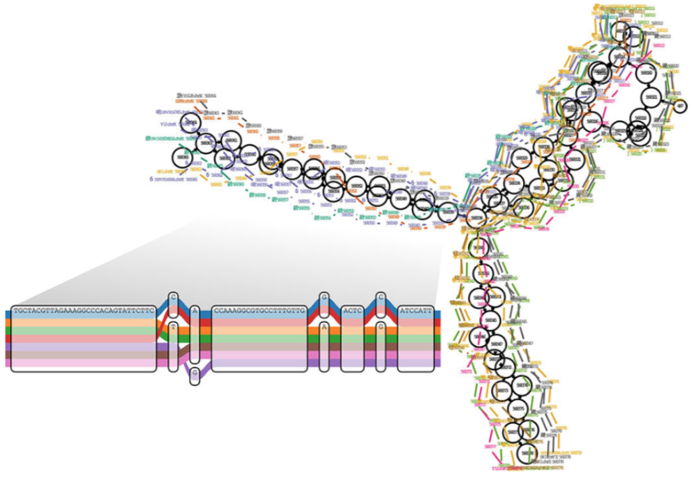

### Reference Graphs

In some applications, like HLA typing, some tools have implemented the storage and searching of reference sequences in _graph structures_. Here's a population reference graph for a section of the yeast genome ... the inset shows alignment of various (strains?) on the base pair level:

