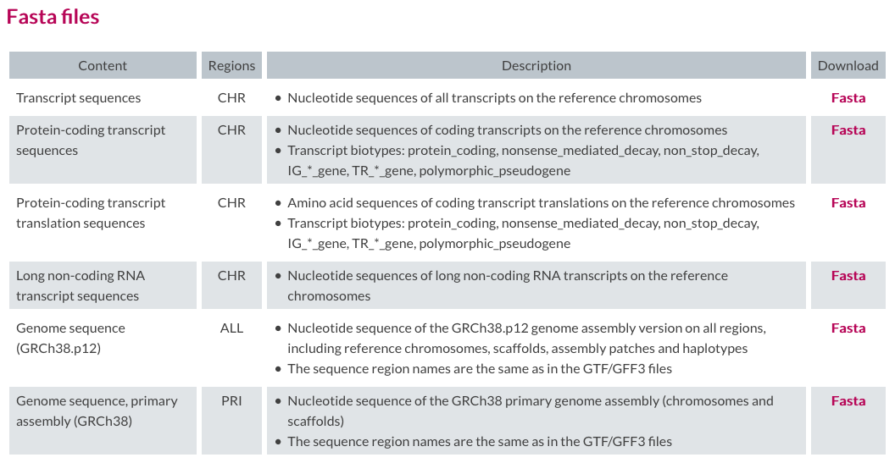
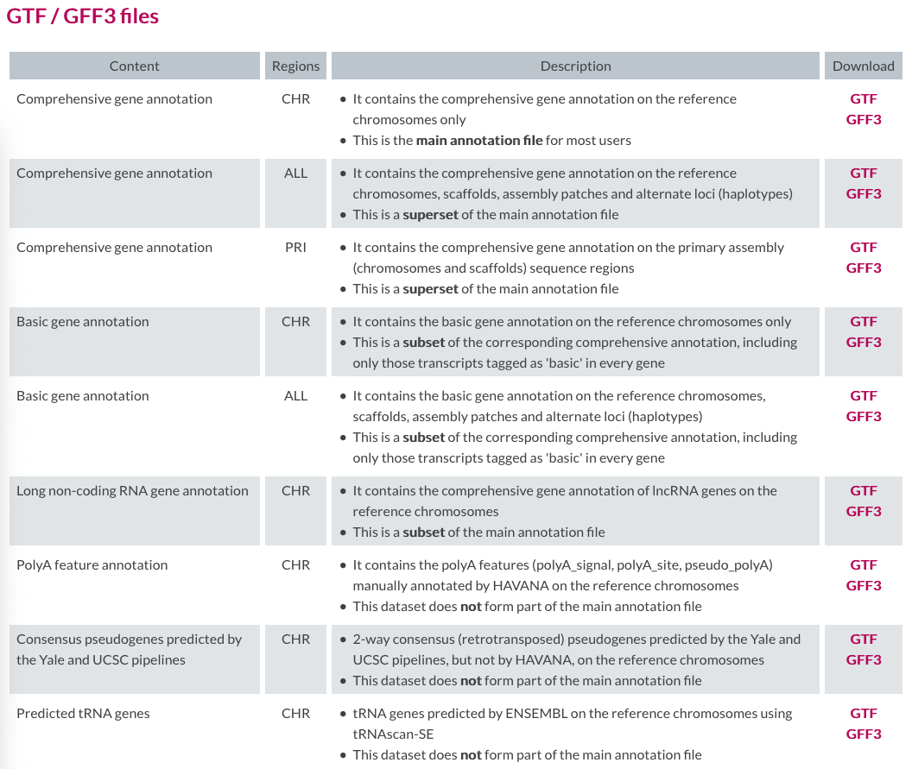
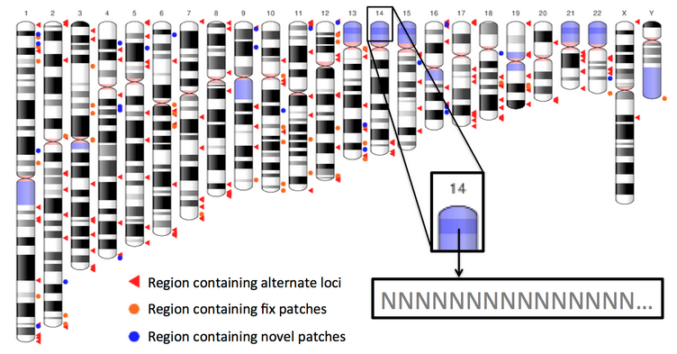
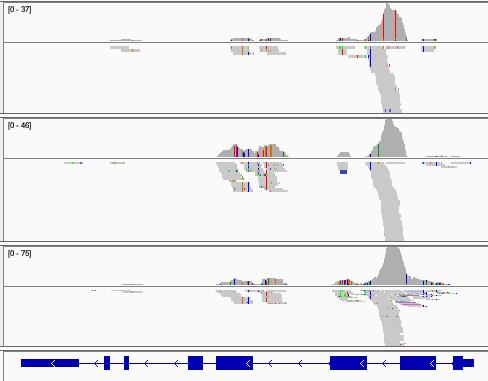
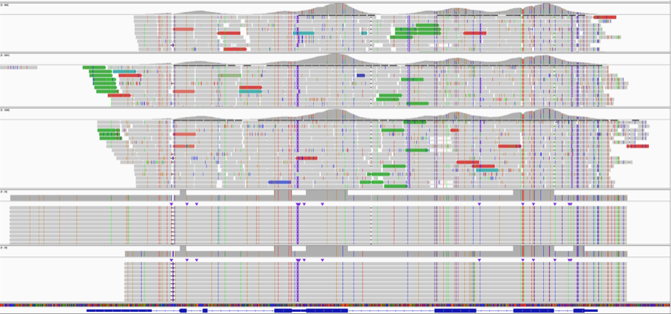

## Humans ...

[GENCODE](https://www.gencodegenes.org/) is a good source for multiple versions of ... multiple versions of the human and mouse genomes. 

The current version of the human genome is "GRCh38" (GRCh = [Genome Reference Consortium](https://www.ncbi.nlm.nih.gov/grc)), but there are many who still use GRCh37 (widely known as "hg19"). GENCODE has multiple "releases" (seem to be only annotation updates, not genome sequence changes).

See GENCODE's [Release history](https://www.gencodegenes.org/human/releases.html) for the full confusing picture.

But let's take a look at the options _within_ the most recent "Reference release (release 31)".

Sequence (genome or transcript):



Gene annotation:



... and Metadata files adding to the information available about genes.

### What's Inside?

In the primary GRCh38 assembly (region "PRI") are the primary chromosome molecules, and also scaffolds that are assembled but not yet placed on the primary chromosomes. We can list them, display their lengths, and a cumulative length column, like this (but don't do this now, it takes many minutes and would eat the WiFi):

```
curl -s ftp://ftp.ebi.ac.uk/pub/databases/gencode/Gencode_human/release_31/GRCh38.primary_assembly.genome.fa.gz \
  | gunzip \
  | tr "\n" "\t" \
  | tr ">" "\n" \
  | grep -v ^$ \
  | perl -ane '$id=shift @F; $id.=" "; $id.=shift @F; $l=length(join("",@F)); $c+=$l; print "$id\t$l\t$c\n"'
```

... results in:

```
chr1 1	248956422	248956422
chr2 2	242193529	491149951
chr3 3	198295559	689445510
chr4 4	190214555	879660065
chr5 5	181538259	1061198324
chr6 6	170805979	1232004303
chr7 7	159345973	1391350276
chr8 8	145138636	1536488912
chr9 9	138394717	1674883629
chr10 10	133797422	1808681051
chr11 11	135086622	1943767673
chr12 12	133275309	2077042982
chr13 13	114364328	2191407310
chr14 14	107043718	2298451028
chr15 15	101991189	2400442217
chr16 16	90338345	2490780562
chr17 17	83257441	2574038003
chr18 18	80373285	2654411288
chr19 19	58617616	2713028904
chr20 20	64444167	2777473071
chr21 21	46709983	2824183054
chr22 22	50818468	2875001522
chrX X	156040895	3031042417
chrY Y	57227415	3088269832
chrM MT	16569	3088286401
GL000008.2 GL000008.2	209709	3088496110
GL000009.2 GL000009.2	201709	3088697819
GL000194.1 GL000194.1	191469	3088889288
GL000195.1 GL000195.1	182896	3089072184
GL000205.2 GL000205.2	185591	3089257775
[...snip...]
KI270748.1 KI270748.1	93321	3098973923
KI270749.1 KI270749.1	158759	3099132682
KI270750.1 KI270750.1	148850	3099281532
KI270751.1 KI270751.1	150742	3099432274
KI270752.1 KI270752.1	27745	3099460019
KI270753.1 KI270753.1	62944	3099522963
KI270754.1 KI270754.1	40191	3099563154
KI270755.1 KI270755.1	36723	3099599877
KI270756.1 KI270756.1	79590	3099679467
KI270757.1 KI270757.1	71251	3099750718
```

So the unplaced scaffolds actually account for ~11 Mbp of the genome.

Let's compare this to the same operations on the the "ALL" fasta file, which includes assembly patches and additional haplotypes:

```
curl -s ftp://ftp.ebi.ac.uk/pub/databases/gencode/Gencode_human/release_31/GRCh38.p12.genome.fa.gz \
  | gunzip \
  | tr "\n" "\t" \
  | tr ">" "\n" \
  | grep -v ^$ \
  | perl -ane '$id=shift @F; $id.=" "; $id.=shift @F; $l=length(join("",@F)); $c+=$l; print "$id\t$l\t$c\n"'
```

... which results in 593 lines (sequences). The original, primary chromosomes, the unplaced scaffolds, _patches_, and _alternate_ sequences that represent divergent haplotypes. For example:

```
KN538363.1 HG2232_PATCH 365499  3102561769
KN538362.1 HG2233_PATCH 208149  3102769918
KQ031385.1 HG2235_PATCH 373699  3103143617
```

or ...

```
KI270920.1 HSCHR19KIR_FH05_A_HAP_CTG3_1 198005  3158097017
KI270921.1 HSCHR19KIR_FH05_B_HAP_CTG3_1 282224  3158379241
KI270922.1 HSCHR19KIR_FH06_A_HAP_CTG3_1 187935  3158567176
```

These sequences represent alternatives for sequence _already in the primary chromosomes_; as such they could draw aligned reads away from the primary chromosomes if they're a comparable or better match to the sample.

Here's an ideogram showing all the affected locations in GRCh38:



... and you can find more [discussion](https://gatkforums.broadinstitute.org/gatk/discussion/7857/reference-genome-components) in the Broad Institute's GATK Forum. To illustrate the alignment problem, here's an IGV view of reads aligned to one of the regions _for which alternative haplotypes exist in the reference:



... and the same read set *realigned* _after removing those alternative haplotype contigs from the reference_.:




